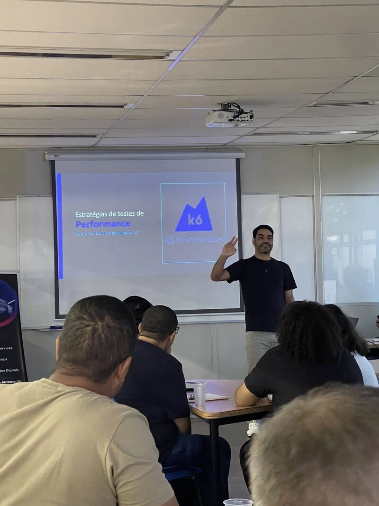
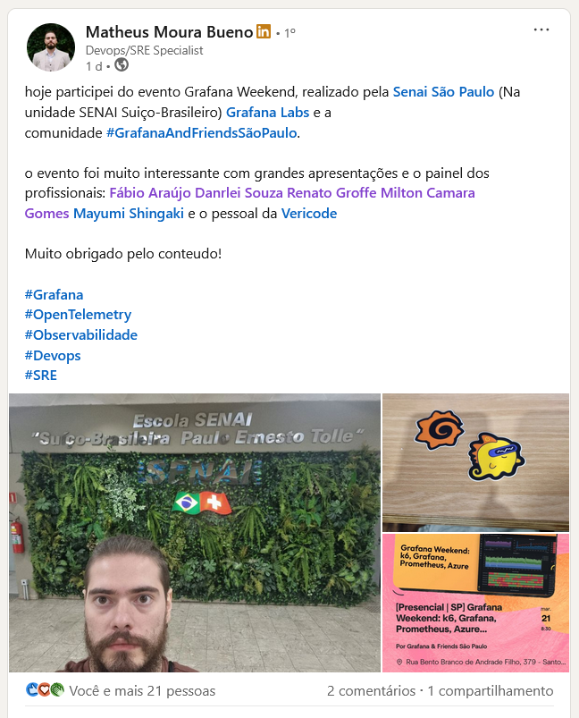
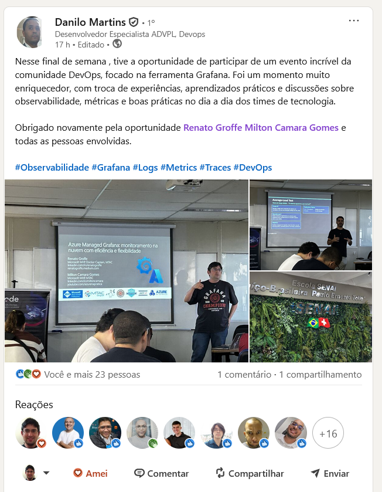
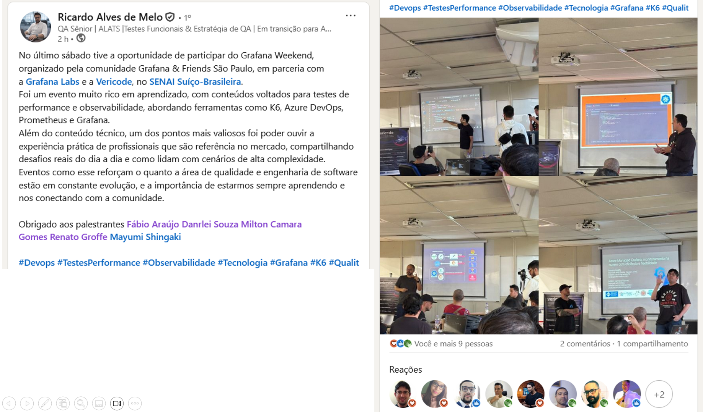
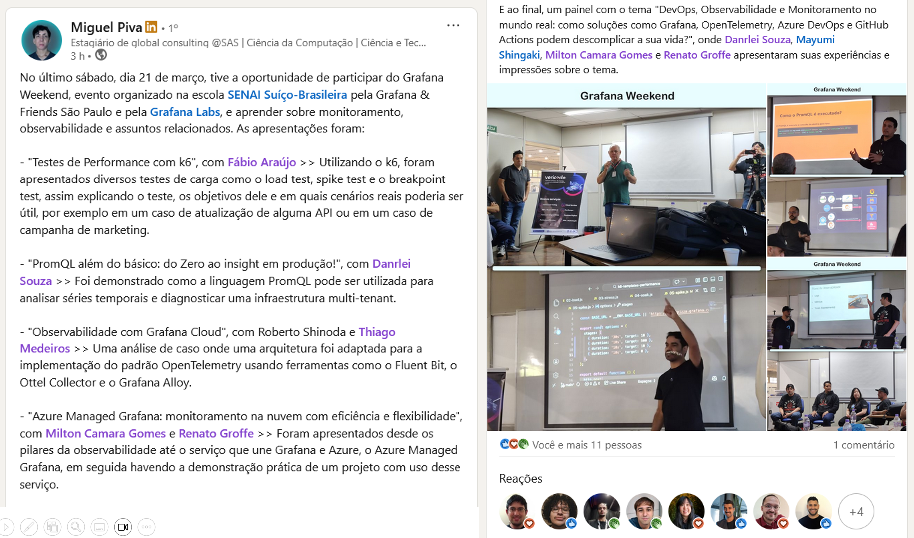
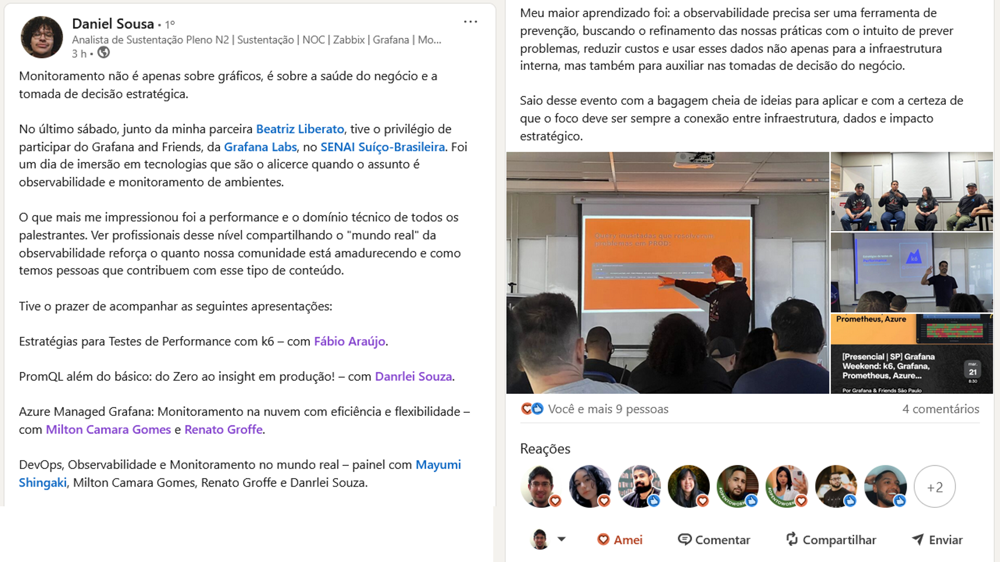
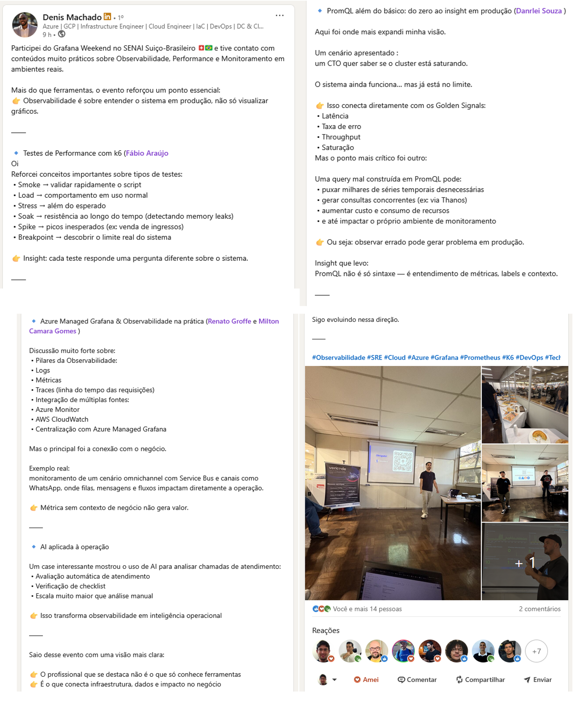

# Grafana Weekend Mar-2026: k6, Grafana, Prometheus, Azure...
Photos and general information about the "Grafana Weekend" event, held in the city of São Paulo-SP.

Date: **03/21/2026 (Saturday)**

Organizers:
- **Renato Groffe (Microsoft MVP, Docker Captain, Grafana Champion, APIsec U Ambassador, MTAC)**
- **Atila Olivi (SENAI)**
- **Fábio Araújo (Dev Referências)**
- **Milton Camara Gomes (Microsoft MVP, MTAC)**

Number of participants: **50 people**

I would like to express my thanks to **SENAI**, **Vericode**, and **Grafana Labs** for all the support in making this event happen.

---

Talks/presentations that took place during the event:

_# Strategies for Performance Testing with k6_

Speaker: **Fábio Araújo (Dev Referências)**

Technologies and topics covered: **k6, Load Testing, Testing Strategies, Automation, DevOps, QA, JavaScript, Go...**

_# PromQL beyond the basics: from Zero to insight in production!_

Speaker: **Danrlei Souza (Grafana Champion)**

Technologies and topics covered: **Grafana, Prometheus, PromQL, Kubernetes, Observability, Monitoring...**

_# Vericode: introducing the company + a real case with Grafana and OpenTelemetry!_

Speakers:
- **Thiago Medeiros (Vericode)**
- **Roberto Shinoda (Vericode)**
- **Joab Junior (Vericode)**

Technologies and topics covered: **Grafana, OpenTelemetry, Observability, Monitoring, Alloy, Tempo, Loki, Mimir, Grafana Cloud, Kubernetes, Docker, Node.js...**

_# Azure Managed Grafana: cloud monitoring with efficiency and flexibility_

Speakers:
- **Renato Groffe (Microsoft MVP, Docker Captain, Grafana Champion, APIsec U Ambassador MTAC)**
- **Milton Camara Gomes (Microsoft MVP, MTAC)**

Technologies and topics covered: **Microsoft Azure, Grafana, Azure Managed Grafana, Microsoft Entra ID, Kubernetes, Prometheus, Azure Kubernetes Service, OpenTelemetry, Azure App Service, Azure Container Apps, Microsoft Foundry, Observability, Monitoring, DevOps, DevSecOps...**

_# Panel: DevOps, Observability and Monitoring in the real world: how can solutions like Grafana, OpenTelemetry, Azure DevOps, and GitHub Actions simplify your life?_

Participants:
- **Danrlei Souza (Grafana Champion)**
- **Mayumi Shingaki (Microsoft MVP)**
- **Milton Camara Gomes (Microsoft MVP, MTAC)**
- **Renato Groffe (Microsoft MVP, Docker Captain, Grafana Champion, APIsec U Ambassador, MTAC)**

Technologies and topics covered: **Grafana, OpenTelemetry, DevOps, DevSecOps, Microsoft Azure, GitHub, Azure DevOps, Docker, Kubernetes, Linux, Grafana, Grafana Loki, Grafana Tempo, Grafana Learn, Prometheus, .NET, Java, Node.js, Python, Go, Azure Monitor...**

---

## Photos

Access this [**link**](/img/) to view all photos from the presentations.

This event was a partnership between the [**Grafana & Friends São Paulo**](https://www.meetup.com/pt-br/grafana-and-friends-sao-paulo/) community, [**Vericode**](https://vericode.com.br/pt), and the [**Escola Senai Suíço-Brasileira Paulo Ernesto Tolle**](https://suicobrasileira.sp.senai.br/).

Registration form: [**Meetup**](https://www.meetup.com/pt-br/grafana-and-friends-sao-paulo/events/313623760/)

Location: **Escola SENAI Suíço-Brasileira Paulo Ernesto Tolle - Rua Bento Branco de Andrade Filho, 379 - Santo Amaro - São Paulo/SP - ZIP 04757-000**

---

## Feedbacks on LinkedIn

_Matheus Moura Bueno_

Link: **https://www.linkedin.com/feed/update/urn:li:activity:7441143446624686080/**

Today I participated in the Grafana Weekend event, held by SENAI São Paulo (at the SENAI Swiss-Brazilian unit), Grafana Labs, and the #GrafanaAndFriendsSãoPaulo community.

The event was very interesting with great presentations and a panel of professionals: Fábio Araújo, Danrlei Souza, Renato Groffe, Milton Camara Gomes, Mayumi Shingaki, and the Vericode team.

Thank you very much for the content!

_Danilo Martins_

Link: **https://www.linkedin.com/feed/update/urn:li:activity:7441648802773770240/**

This past weekend, I had the opportunity to participate in an incredible DevOps community event focused on the Grafana tool. It was a very enriching experience, with the exchange of knowledge, practical learning, and discussions about observability, metrics, and best practices in the daily work of technology teams.

Thank you again for the opportunity, Renato Groffe, Milton Camara Gomes, and everyone involved.

_Denis Machado_

Link: **https://www.linkedin.com/feed/update/urn:li:activity:7441682341506359296/**

I attended the Grafana Weekend at SENAI Suíço-Brasileiro 🇨🇭🇧🇷 and had contact with very practical content about Observability, Performance, and Monitoring in real environments.

More than tools, the event reinforced an essential point:

👉 Observability is about understanding the system in production, not just viewing graphs.

🔹 Performance Testing with k6 (Fábio Araújo)
I reinforced important concepts about types of tests:
 • Smoke → quickly validate the script
 • Load → behavior under normal usage
 • Stress → beyond expected levels
 • Soak → endurance over time (detecting memory leaks)
 • Spike → unexpected peaks (e.g., ticket sales)
 • Breakpoint → discover the system's real limit

👉 Insight: each test answers a different question about the system.

🔹 PromQL beyond the basics: from zero to insight in production (Danrlei Souza)

This is where I expanded my vision the most.
A scenario presented:
A CTO wants to know if the cluster is saturating.
The system still works… but it's already at its limit.

👉 This connects directly with the Golden Signals:
 • Latency
 • Error rate
 • Throughput
 • Saturation
But the most critical point was another:

A poorly constructed PromQL query can:
 • Pull thousands of unnecessary time series
 • Generate concurrent queries (e.g., via Thanos)
 • Increase cost and resource consumption
 • And even impact the monitoring environment itself

👉 In other words: observing incorrectly can cause problems in production.

Insight I take away:
PromQL is not just syntax — it's understanding metrics, labels, and context.

🔹 Azure Managed Grafana & Observability in practice (Renato Groffe and Milton Camara Gomes)

Very strong discussion about:
 • Pillars of Observability:
 • Logs
 • Metrics
 • Traces (request timeline)
 • Integration of multiple sources:
 • Azure Monitor
 • AWS CloudWatch
 • Centralization with Azure Managed Grafana

But the main takeaway was the connection with the business.

Real example:
Monitoring an omnichannel scenario with Service Bus and channels like WhatsApp, where queues, messages, and flows directly impact operations.

👉 Metrics without business context don't generate value.

🔹 AI applied to operations
An interesting case showed the use of AI to analyze customer service calls:
 • Automatic service evaluation
 • Checklist verification
 • Much greater scale than manual analysis

👉 This transforms observability into operational intelligence.

I leave this event with a clearer vision:

👉 The professional who stands out is not the one who only knows tools.

👉 It's the one who connects infrastructure, data, and business impact.

I continue evolving in this direction.

